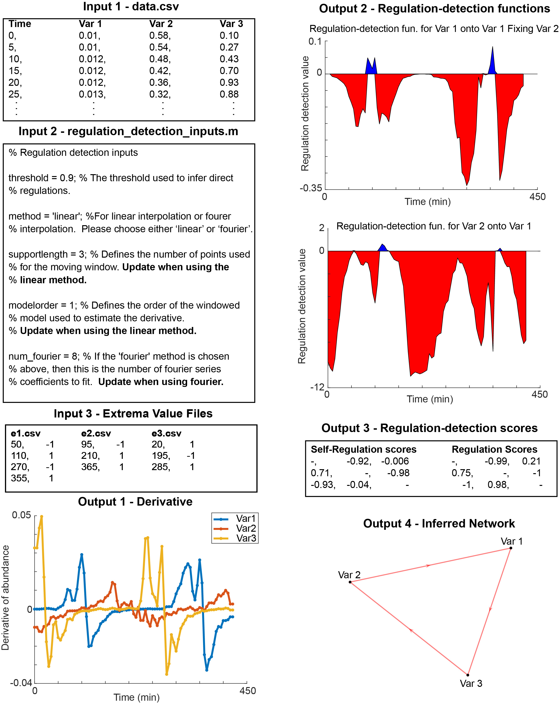
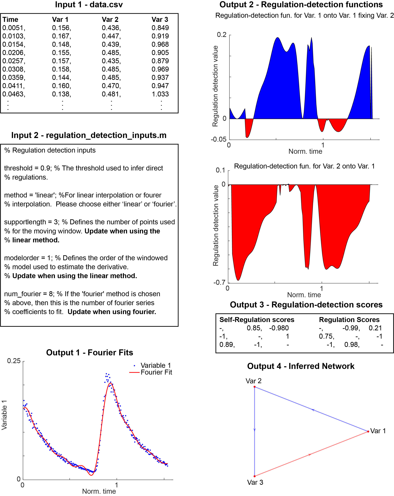

# ION

This repository contains the MATLAB implementation and examples of the ION (Inferring Oscillatory Networks) package used in the article: 

**Insert link to biorxiv article**

## How to use

As described in the article linked above, we developed a computational package, ION (Inferring Oscillatory Networks), to infer networks of biological oscillators.  We have published the ION package in MATLAB, which can be used as follows.  

1. *Generate the data.csv file* The first column of the data.csv file should be the time points at which the measurements were taken.  The subsequent columns should be the data for each variable at the respective time points.  If the data are stored in an excel spreadsheet, order the file as time points in column 1, data for variable 1 in column 2, data for variable 2 in column 3, etc., and then save it as a .csv file in the same directory as the code.  Be sure that there are no variable names at the top of the data.csv file (see the Linear Schematic figure below for the format of the data.csv file).

2. *Update the regulation_detection_inputs.m file*  Users need to specify the threshold used to infer regulation and the data interpolation method, in particular, either 'linear' or 'fourier'.  The linear method will linearly interpolate the discrete data given in the data.csv file to create a continuous data set.  The fourier method will fit a Fourier series to the discrete data to create a continuous data set. 
  
    1. *Update the threshold variable* The variable *threshold* determines the threshold for the accepted interactions. Based on our analysis in the article linked above, we recommend a threshold of 0.9, which we use for inferring interactions given experimental data (see the Linear and Fourier Schematics below).
      
    2. *If linear method is chosen, update the variables 'supportlength' and 'modelorder' (See the Linear Schematic below)* These two variables need to be chosen so that the function movingslope.m accurately estimates the derivatives at each time point of the data set.  The variable 'supportlength' determines the number of points used for the moving window average estimation of the derivative, so it should be at least 2 and no more than the number of data points.  If 'supportlength' is odd, then the derivative is estimated using a central sliding window.  If 'supportlength' is even, then the moving window will be moved backward by one element.  For example, a 'supportlength' of 2 is equal to a difference quotient, computed for instance using the MATLAB function diff.  Next, the variable 'modelorder' defines the order of the windowed model used to estimate the slope. If 'model order' is 1 or less than the 'supportlength'-1, then the model is linear or a regression, respectively.  If 'modelorder' is equal to 'supportlength'-1, then the method will be a sliding Lagrange interpolant.
      
3. *If linear method is chosen, create extrema value files for each variable and save them in the same directory as the scripts (See Linear Schematic Below)* If the fourier method is chosen, the interpolated time series has one global maximum and minimum per cycle. However, if the linear method is chosen, local extrema can occur due to noise. To distinguish such local extrema from the global extrema per cycle, which is required to compute the reflection time (see the article), users need to input extrema value files for each variable in the data set.  The files should be saved as e*k*.csv where *k* corresponds to the variable.  For example, the extrema value file for variable 1 (the first data column) should be saved as e1.csv.  The extrema value files should have time points in the first column and either 1 or -1 in the second column for a global maximum and a global minimum in that period at the time point, respectively.  Users can generate these files by using the MATLAB function findpeaks.  The function findpeaks returns all local minima and maxima, which users can use to decide the global minimum and maximum in each period.

4. *Run the main.m function* The main.m function will read the inputs from the regulation_detection_inputs.m file and run the algorithm with the user-specified method.  If the linear (fourier) method was chosen, the main.m function calls the main_linear.m (main_fourier.m) script to run the algorithm.  Users will see several figures being generated as well as several output files generated in a new "Outputs" directory, which will be created within the same directory that the script is run (see Linear and Fourier Schematics below):

    1. If the linear method is chosen, a derivative.fig file that plots the estimated derivative values for all variables.
      
    2. If the fourier method is chosen, files labeled Var*k*.fig, where *k* corresponds to the variable number, showing the fourier fits for each variable.  
      
    3. Figures plotting the regulation-detection functions for each possible interaction.  For example, the file Reg_detect_i_onto_i_fix_j.fig plots the regulation-detection function corresponding to the self-regulation of Variable *i* when fixing Variable *j*.  See the article linked above for more details. 
      
    4. A .mat file with the regulation-detection scores for each possible self-regulation ('R\_self' variable) and cross-regulation ('R\_cross' variable).
      
    5. A figure plotting the inferred network structure, inferred_network_graph.fig.  If R_self*(i,j) <* -threshold and |R_cross*(i,j)| >* threshold, then the algorithm infers the interaction from Variable *j* to Variable *i*.  Moreover, if R_cross*(i,j)* is positive (negative), then it is a positive (negative) regulation.
      
    6. A Final_results.pdf document that reports each output listed above for reference.
    
### Linear Schematic

### Fourier Schematic

## Examples

We include various example applications of ION from the article linked above, namely, applied to the FitzHugh-Nagumo model as well as a repressilator, combined repressilator, and estradiol data set.
